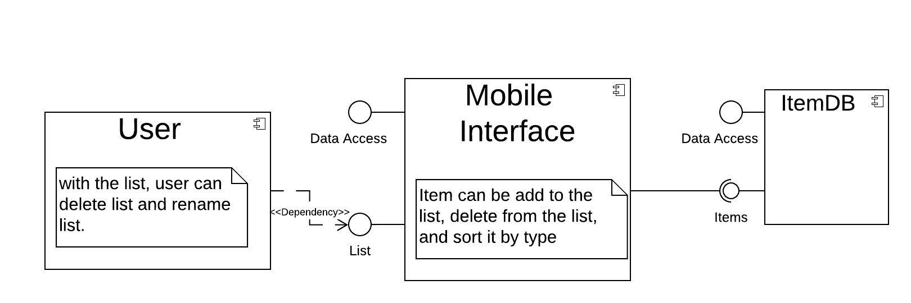

# Design Document

**Author**: \<Team 7\>

## 1 Design Considerations

Architecture, Compliance, Customer Tastes, Design Constraints, Durability, Efficiency, Experience, Extensibility, Features, Functionality, Performance, Reusability, Scalability, Security, Usability.

### 1.1 Assumptions

The app release date will be the same as our target date.
End users will be available to test during the time they agree to.
Project cost will stay the same as initially budgeted.
The project scope will not change once the stakeholders sign off on the scope statement.
Project will follow agile methodology throughout execution.
Project will follow team governance guidelines and requirements.
The team will be using android studio to build the app.
The solution will use the existing test environment along with a few manual test cases to ensure that the specification requirements are met.

### 1.2 Constraints

The system will work on our existing technical infrastructure - no new technologies will be introduced.
The system shall be available 99.99% of the time for any 24-hour period.
The budget is set tom comply with the deliverable date of the product.
Product must be delivered on the time agreed upon.
The finish product must meet the specification requirements.
The user experience must match that of the stakeholders.

### 1.3 System Environment

The system will interact with android devices that have an API level of 21 and above.

## 2 Architectural Design

### 2.1 Component Diagram

### 2.2 Deployment Diagram

## 3 Low-Level Design

The user (UI) depends on the lists that was provided by the Mobile Interface component in order to rename the list and delete the list. The Mobile Interface component provides lists that is needed by the user and the data access. It requires the items that was provided by the ItemDB component in order to add and delete an item from the list and check off an item from the list. The ItemDB provides Data Access and items for the Mobile Interface component.

### 3.1 Class Diagram

## 4 User Interface Design

