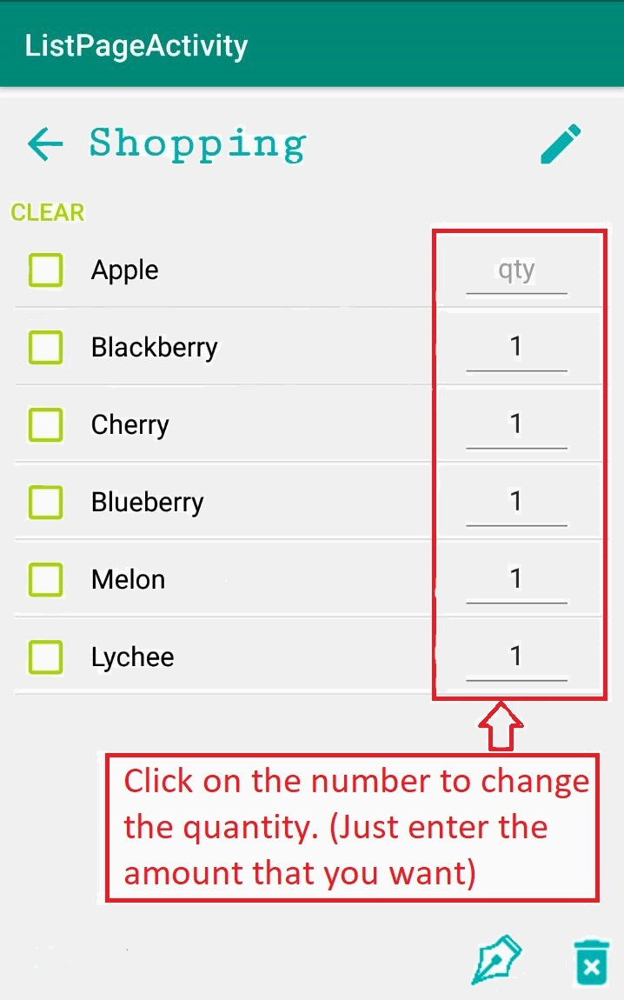

# User Manual

## Overview

**GroceryListManager** is an app that allows the user to create their own grocery lists and use it when they at grocery stores. With **GroceryListManager** app, they can add, delete, edit, and check-off items in any list they make. They could also create as much list as they want and can modify the lists the same way as the items.

## Basic Features

### when you first launch the app, you will be on the homepage where all your lists are displaying.  

## In this page you could:

# Create List

  

# Rename List

  

# Delete List

  

### After you have created your list(s). You could modify the list(s) by click on the list name. Now you will be on the list page. In this page, you could:

# Add Item

  

# Delete Item

  

# Clear All

  

# Add New Items To The Data Base

  

# Change the Quantity

  

# To Report a Bug

# Sort The List By Item Type

